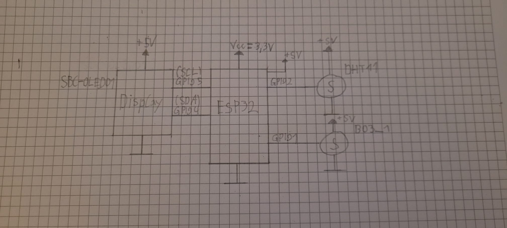
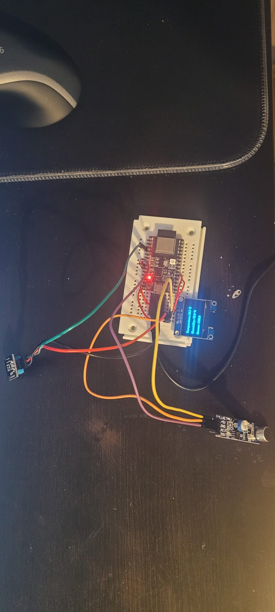
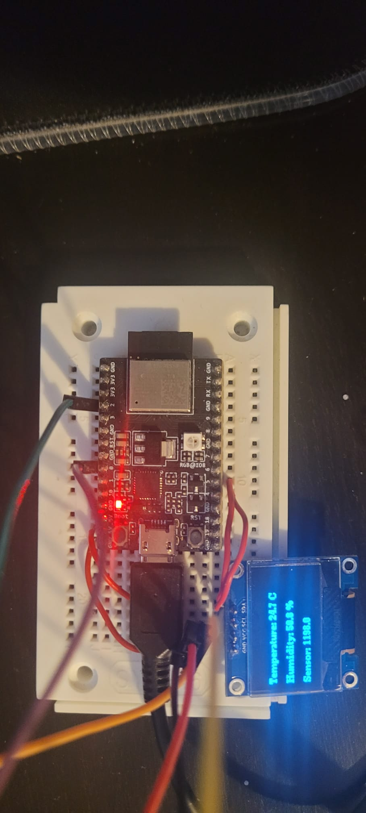

# Wetterstation

Verfasser: **Sargsian Daniel, Saferyjski Maksymilian**

Datum: **27.05.2025**

## 1.  Einführung
Im Rahmen dieses Projekts wurde ein einfaches Messsystem entwickelt, das Umweltdaten wie Temperatur, Luftfeuchtigkeit und Sensormesswerte erfasst, verarbeitet und darstellt. Ziel war es, die Daten sowohl lokal über ein Webinterface als auch extern über eine API und eine Datenbank zugänglich zu machen. Zusätzlich wurde ein Display zur direkten Anzeige sowie ein RGB-Colorpicker zur Konfiguration des Status integriert.
## 2. Projektbeschreibung                                                           
Im Projekt wurde eine Wetterstation umgesetzt, die Messwerte wie Temperatur, Luftfeuchtigkeit und Sensordaten erfasst und auf verschiedene Weise zugänglich macht. Die Daten werden dabei lokal angezeigt, per API bereitgestellt, in einer Datenbank gespeichert und über ein Webinterface grafisch dargestellt.
## 3. Theorie                                                                        
Für die Umsetzung der Wetterstation waren mehrere technische Kompetenzen nötig, die im Unterricht oder im Selbststudium erarbeitet wurden:

**ESP32**

Grundkenntnisse über den Mikrocontroller waren erforderlich - z. B. Pinzuweisungen, Spannungslimits, Initialisierung von Sensoren, Nutzung der GPIOs und die Integration von Bibliotheken für Sensoren und das Display.

**Netzwerk**

Der ESP32 wurde über WLAN mit dem Internet verbunden. Es wurden HTTP-GET/POST-Anfragen verwendet, um Messwerte an einen Webserver zu senden oder Zeitdaten über NTP zu holen. Kenntnisse über IP-Adressen, Ports und Protokolle waren dafür notwendig.

**Web/API**

Um die Daten online verfügbar zu machen, wurden APIs genutzt - z. B. die Blynk-Cloud oder Discord-Webhooks. Die Kommunikation lief dabei über das JSON-Format, welches geparst und erstellt werden musste.

**Dateisystem (LittleFS)**

Um Konfigurationen dauerhaft zu speichern (z. B. WLAN-Zugangsdaten oder Blynk-Token), wurde das interne Dateisystem des ESP32 verwendet. Mit LittleFS konnten Dateien gelesen und geschrieben werden.

**Display & LEDs**

Messdaten wurden am OLED angezeigt. Zusätzlich wurden Status-LEDs (RGB) zur Visualisierung von Problemen oder Warnungen verwendet - z. B. rote LED bei Überhitzung oder blinkend blau bei WLAN-Ausfall.

**Debugging**

Die serielle Konsole war ein wichtiges Werkzeug, um Fehler zu erkennen (z. B. keine Verbindung zum Server, fehlerhafte Sensoren). Auch LED-Farben halfen beim schnellen Erkennen von Problemen ohne angeschlossenen PC.

## 4.   Arbeitsschritte

### Benötigte Hardware

Breadboard

ESP32 Development Board

DHT11 Temperatursensor (mit Feuchtigkeitssensor)

B03_1 Mikrofon

OLED Display (I2C, z.B. 128x64 Pixel)

Verbindungskabel (Jumper)

USB-Kabel zum Programmieren des ESP32

### Benötigte Software und Bibliotheken

Arduino IDE oder eine andere Entwicklungsumgebung für ESP32

ESP32 Board Support in Arduino IDE installiert

Folgende Arduino-Bibliotheken:

DHT sensor library von Adafruit

Adafruit Unified Sensor

U8g2 (für OLED Display)

NeoPixelBus (für NeoPixel LED)

WiFiManager (für WLAN-Konfiguration)

Blynk (für die Cloud-Kommunikation)

HTTPClient (für HTTP-Requests)

Für LittleFS muss das Dateisystem-Plugin installiert sein (Arduino IDE: Sketch -> Include Library -> Manage Libraries -> nach LittleFS suchen und installieren)

Einen Discord-Server mit Webhook-URL

SQL-Datenbank mit HTTP-Endpoint zum Speichern der Messwerte (Eigenes Backend oder fertiger Webservice)

### Verdrahtung

Anschlüsse am ESP32:

Bauteil	ESP32 Pin

DHT11 Data is GPIO 2

SDA is GPIO 4

SCL is GPIO 5

DHT11 VCC	3.3V oder 5V (je nach DHT11)

DHT11 GND	GND

### Einrichten der Entwicklungsumgebung

ESP32 Boarddefinition in Arduino IDE hinzufügen (falls noch nicht geschehen):

Datei -> Voreinstellungen -> Zusätzliche Boardverwalter-URLs:

https://raw.githubusercontent.com/espressif/arduino-esp32/gh-pages/package_esp32_index.json

Dann unter Werkzeuge -> Board -> Boardverwalter -> ESP32 installieren.

Alle benötigten Bibliotheken installieren:

Menü Sketch -> Bibliothek einbinden -> Bibliotheken verwalten

Suche nacheinander nach DHT, U8g2, NeoPixelBus, WiFiManager, Blynk, HTTPClient und installiere sie.

LittleFS-Dateisystem Plugin installieren, damit du Dateien auf den ESP32 laden kannst.

### Vorbereitung der Dateien

Passe die Werte an deine Umgebung an (Blynk Token, Server URL etc.)

### Hochladen des Programms

Öffne den Arduino-Sketch mit deinem Code.

Passe im Code bei Bedarf die Pin-Definitionen an, falls du andere Pins verwendest.

Wähle das richtige ESP32-Board und den COM-Port aus.

Kompiliere und lade den Sketch auf den ESP32.

Öffne den Seriellen Monitor (115200 Baud) zur Überwachung.

### WLAN-Verbindung konfigurieren

Beim ersten Start öffnet sich ein WLAN-Access-Point ESP32-Access-Point.

Verbinde dich mit diesem Netzwerk über dein Smartphone oder PC.

Ein Konfigurationsportal öffnet sich (Captive Portal).

Wähle dein Heim-WLAN aus, gib das Passwort ein.

ESP32 verbindet sich mit dem WLAN und startet neu.

### Funktionsweise

Sensorwerte lesen: DHT11 misst Temperatur und Luftfeuchtigkeit.

Anzeige: OLED zeigt die Werte mit grafischer Darstellung an.

Status-LED: NeoPixel blinkt in verschiedenen Farben je nach Zustand (z.B. grün bei Verbindung, rot bei Fehler).

Blynk: Sendet die Werte an dein Blynk-Dashboard für Fernüberwachung.

HTTP Request: Überträgt die Messwerte als GET-Anfrage an deinen MySQL-Webserver.

Discord-Webhook: Schickt bei bestimmten Ereignissen (z.B. Start, Fehler) eine Nachricht an deinen Discord-Kanal.

Konfiguration: Werte aus config.txt werden beim Start geladen, um Token und Serverdaten bereitzustellen.

### Bilder und Schaltungen

## 5. Zusammenfassung
Das Projekt war eine Wetterstation auf Basis des ESP32, die Temperatur, Luftfeuchtigkeit und Sensorwerte misst, lokal anzeigt und über WLAN an einen Server sowie per Discord-Webhook überträgt. Die Konfiguration wird über LittleFS gespeichert und ist über ein Webinterface anpassbar. Die visuelle Rückmeldung erfolgt über ein OLED-Display und eine RGB-LED.
Während der Arbeit gab es ein paar Probleme: Der Zugriff auf die Discord-API über HTTPS war schwierig einzurichten. Auch das Zusammenspiel von Display und Sensor hat anfangs nicht richtig funktioniert. Außerdem mussten wir die Zeitabstände für die Messungen genau einstellen, damit die Werte genau und stabil sind. Ein weiteres Problem war der Speicherplatz, der schnell voll war. Am Ende konnten wir aber alle Probleme lösen.

## 6.  Quellen
Volodymyr Shymanskyy et al., “Blynk IoT Platform - Blynk Library for ESP32,” GitHub. [online]. Available at: https://github.com/blynkkk/blynk-library. [Accessed 27 May 2025].

Tzapu, “WiFiManager - Autoconnect WiFi with ESP8266/ESP32,” GitHub. [online]. Available at: https://github.com/tzapu/WiFiManager. [Accessed 27 May 2025].

me-no-dev, “ESPAsyncWebServer Library for ESP32,” GitHub. [online]. Available at: https://github.com/me-no-dev/ESPAsyncWebServer. [Accessed 27 May 2025].

Adafruit Industries, “Adafruit NeoPixel Library,” GitHub. [online]. Available at: https://github.com/adafruit/Adafruit_NeoPixel. [Accessed 27 May 2025].

Adafruit Industries, “DHT Sensor Library for Arduino,” GitHub. [online]. Available at: https://github.com/adafruit/DHT-sensor-library. [Accessed 27 May 2025].

olikraus, “U8g2 Library,” GitHub. [online]. Available at: https://github.com/olikraus/u8g2. [Accessed 27 May 2025].

lorol, “LittleFS for ESP32,” GitHub. [online]. Available at: https://github.com/lorol/ESP32LittleFS. [Accessed 27 May 2025].

Discord Inc., “Discord Webhook API Documentation,” Discord Developers. [online]. Available at: https://discord.com/developers/docs/resources/webhook. [Accessed 27 May 2025].

NTP Pool Project Community, “NTP Pool Project,” pool.ntp.org. [online]. Available at: https://www.pool.ntp.org. [Accessed 27 May 2025].

